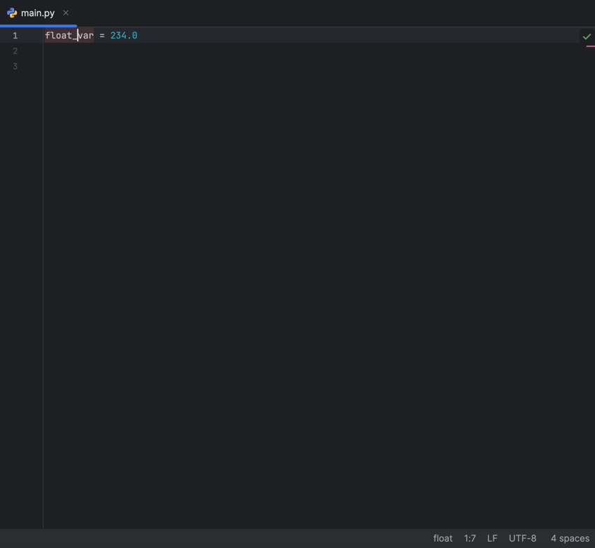

# Status Bar Variable Type
This repository contains the code of a PyCharm plugin that displays the type of a variable under the caret in the status bar.
This plugin displays the variable type next to the position widget (in the status bar) but only works with a single caret. If multiple carets are used, it won’t display anything. It’s also limited to Python files and doesn’t support other programming languages.
## Example 1: Float variable type

## Example 2: String variable type

## Example 3: Tuple variable type

